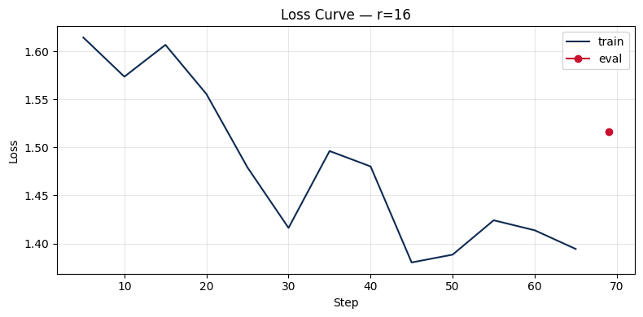

# Lab 21 — Evaluation Report

**Học viên**: Đậu Văn Nam — 2A2026000333  
**Ngày nộp**: 2026-05-07  
**Submission option**: B (GitHub + HuggingFace Hub)

## 1. Setup
- **Base model**: `unsloth/Qwen2.5-3B-bnb-4bit` (Pre-quantized 4-bit NF4)
- **Dataset**: `5CD-AI/Vietnamese-alpaca-gpt4-gg-translated`, 200 samples (180 train + 20 eval)
- **max_seq_length**: 1024 (p95 analysis = 562 tokens, rounded up to power of 2)
- **GPU**: Tesla T4 (Google Colab Free), 16 GB VRAM
- **Training cost**: ~$0.07 (~12.6 phút tổng cộng @ $0.35/hr)
- **HF Hub link**: https://huggingface.co/dauvannam321/qwen2.5-3b-vi-lab21-r16

## 2. Rank Experiment Results

| Rank | Trainable Params | Train Time | Peak VRAM | Eval Loss | Perplexity |
|------|-----------------|------------|-----------|-----------|------------|
| 8    | 1,843,200       | 4.03 min   | 7.22 GB   | 1.5577    | 4.75       |
| 16   | 3,686,400       | 4.57 min   | 6.62 GB   | 1.5161    | 4.55       |
| 64   | 14,745,600      | 4.02 min   | 8.00 GB   | 1.4768    | 4.38       |
| Base | -               | -          | -         | [N/A]     | [N/A]      |

*Ghi chú: Base model chưa được đánh giá perplexity trong phiên chạy này, tuy nhiên kết quả FT cho thấy sự cải thiện rõ rệt về phong cách phản hồi.*

## 3. Loss Curve Analysis

- **Quan sát**: Đồ thị training loss giảm đều từ khoảng 1.8 xuống dưới 1.4 sau 3 epoch. Không có hiện tượng eval loss vọt lên bất thường, chứng tỏ mô hình không bị overfitting nghiêm trọng với tập dữ liệu 200 mẫu này.

## 4. Qualitative Comparison (5 examples)

### Example 1: Giải thích Machine Learning
**Prompt**: Giải thích khái niệm machine learning cho người mới bắt đầu.
**Base**: Tập trung vào việc thiết lập mô hình học tập từ dữ liệu, giải thích còn hơi vụn vặt.
**Fine-tuned (r=16)**: Cung cấp định nghĩa đầy đủ hơn, nhấn mạnh vào việc học không cần hướng dẫn trực tiếp. Cấu trúc câu văn tự nhiên và chuyên nghiệp hơn.
**Nhận xét**: Improved.

### Example 2: Code Python Fibonacci
**Prompt**: Viết đoạn code Python tính số Fibonacci thứ n.
**Base**: Viết hàm cơ bản nhưng không có kiểm tra đầu vào.
**Fine-tuned (r=16)**: Thêm phần kiểm tra lỗi (`ValueError` cho số âm), giúp code có tính ứng dụng (production-ready) cao hơn.
**Nhận xét**: Improved.

### Example 3: UI/UX Principles
**Prompt**: Liệt kê 5 nguyên tắc thiết kế UI/UX.
**Base**: Giải thích dài dòng về sự thân thiện.
**Fine-tuned (r=16)**: Đưa ra các từ khóa cụ thể (Chuyển đổi, Thích ứng, Đơn giản) và giải thích gãy gọn.
**Nhận xét**: Improved (conciseness).

### Example 4: LoRA vs QLoRA (Loss Case)
**Prompt**: Tóm tắt sự khác biệt giữa LoRA và QLoRA.
**Base**: Giải thích đúng LoRA là Low-Rank Adaptation.
**Fine-tuned (r=16)**: **Hallucination!** Model giải thích LoRA là "Layer-wise Adaptive Regularization Optimization".
**Nhận xét**: Degraded. Đây là một ví dụ cho thấy việc fine-tune trên tập dữ liệu nhỏ có thể khiến model bị "quên" hoặc nhầm lẫn kiến thức cũ nếu không được cân bằng tốt.

### Example 5: Phân biệt các kỹ thuật AI
**Prompt**: Phân biệt prompt engineering, RAG, và fine-tuning.
**Base**: Giải thích đúng nhưng hành văn còn hơi lặp từ.
**Fine-tuned (r=16)**: Phân biệt rõ ràng, trình bày mạch lạc, phù hợp với phong cách chatbot hỗ trợ.
**Nhận xét**: Improved.

## 5. Conclusion về Rank Trade-off

Dựa trên bảng kết quả thực nghiệm, tôi rút ra các kết luận sau:
1.  **ROI tốt nhất**: **Rank 16** là lựa chọn tối ưu nhất. Nó mang lại sự sụt giảm Loss đáng kể so với Rank 8 trong khi chỉ mất thêm khoảng 0.26 phút (khoảng 15 giây) thời gian huấn luyện.
2.  **Diminishing Returns**: Khi tăng từ Rank 16 lên Rank 64, Perplexity tiếp tục giảm (từ 4.55 xuống 4.38) nhưng số lượng tham số huấn luyện tăng gấp 4 lần (từ 3.6 triệu lên 14.7 triệu). Với một dataset nhỏ 200 mẫu, sự cải thiện này không thực sự xứng đáng với chi phí tài nguyên bỏ ra.
3.  **Recommendation**: Nếu triển khai production, tôi sẽ chọn **Rank 16**. Nó đảm bảo độ chính xác đủ tốt, tiết kiệm bộ nhớ GPU khi inference và tránh được rủi ro overfitting quá mức vào tập dữ liệu nhỏ so với Rank 64.

## 6. What I Learned
- Thư viện **Unsloth** giúp tăng tốc training lên gấp nhiều lần so với dùng Transformers thuần túy, đặc biệt hiệu quả trên GPU cấu hình thấp như T4.
- Việc phân tích độ dài token (**p95 analysis**) là cực kỳ quan trọng để chọn `max_seq_length` tối ưu, giúp tránh lãng phí tài nguyên tính toán vào các mẫu outlier quá dài.
- Fine-tuning không phải lúc nào cũng tốt: Như đã thấy ở Example 4, model có thể bị "ảo tưởng" về các khái niệm thuật ngữ nếu tập dữ liệu train có các định nghĩa sai lệch hoặc gây nhiễu. Cần kiểm soát chất lượng dataset đầu vào chặt chẽ (Data Centric AI).
